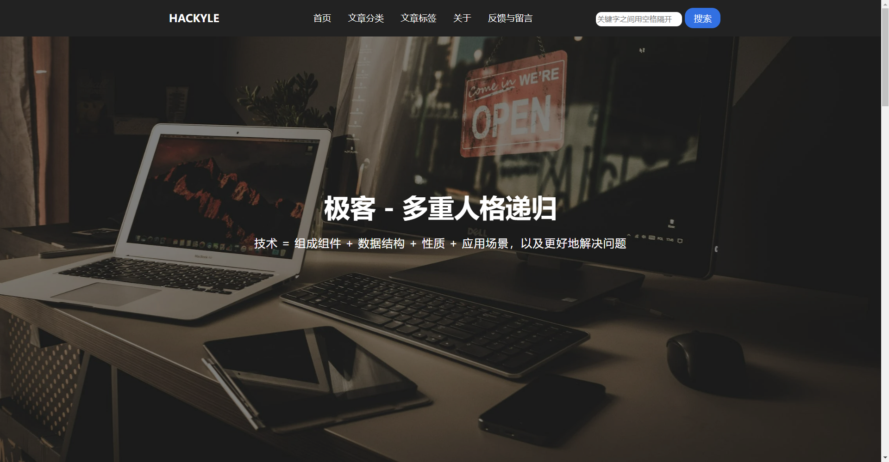
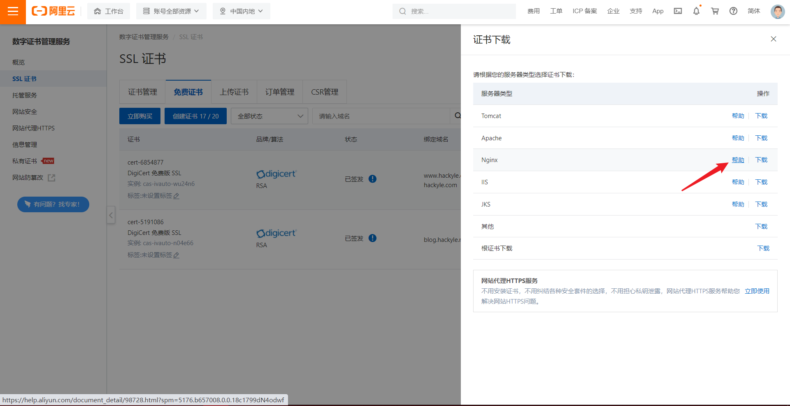

**一款简单且纯粹的博客系统** 

**A Simple and Pure Blog System**


**文件夹释义**

- blog-business-boot：后台管理系统后端

- blog-business-vue2：后台管理系统前端

- blog-consumer：前台用户端

**B端、C端**

- C端：Consumer（也可理解为Customer），通常为消费者、个人终端用户使用的客户端。如：淘宝主页、网易云主页。在博客系统中，C端主要为客户提供文章展示。

- B端：Business，通常为企业内部或商家使用的系统或平台。如：企业内部ERP管理系统、财务管理平台等。在博客系统，B端主要为作者提供文章的管理（写文章、修改文章等）。


# 快速预览

> 后台管理端-写文章页面的示例


> 前台展示端：首页



# 功能特性

> 版本0.6.0的功能特性

**文章管理（Article）**

- 文章管理：查询文章列表、新增文章、编辑文章、删除文章
- 文章分类管理：查询分类列表、新增分类、编辑分类、删除分类
- 文章标签管理
- 文章作者管理

 **评论管理（Comment）**

- 客户端添加评论（增加操作）
- 管理端对评论进行管理（删除、是否发布等操作）

**内容管理（Content）**

- 友链管理：查询友链列表、新增友链、编辑友链、删除友链

- 客户留言板、问题反馈

**配置中心（Configuration Center）**

- Admin info

**系统管理（System Manage）**

- 服务器状态

- 日志信息


# 技术栈

**后台端**

- 前端：Vue2生态（基于PanJiaChen大佬的开源项目：https://github.com/PanJiaChen/vue-admin-template/）
- 后端：SpringBoot生态

**前台端**

- 前后端不分离，使用Thymeleaf在后端将页面渲染后，发给浏览器解析。不分离的主要目的是便于SEO！
- SpringBoot + Thymeleaf


# 本地运行

**step1：环境准备&检查**

- Java：11
- SpringBoot：2.3.12.RELEASE
- Apache Maven：3.6.3
- Vue：2.6.11
- Node：16.14.2
- npm：8.5.0

**Step2：启动MySQL、Redis、Minio**

**step3：下载本仓库到本地**

**B端**

1. 进入到blog-business-boot目录，执行初始化SQL：sql/blog_hackyle_com.sql
2. 在IDEA中打开，等待Maven自动配置
3. 运行启动类：/src/main/java/com/hackyle/blog/business/BlogBusinessApp.java
4. 进入到blog-business-vue2目录，打开一个终端，安装依赖：npm install
5. 运行项目：npm run serve

**C端**

1. 进入到blog-consumer目录，在IDEA中打开，等待Maven自动配置
2. 运行启动类：/src/main/java/com/hackyle/blog/consumer/BlogConsumerApp.java

# 设计与实现概述

- 所有的请求全部打在Nginx上，使用Nginx进行分流到不同的本地服务上
- 使用Minio作为静态资源的存取容器，符合数据与程序分离的思想
- 使用HTTPs保证数据传输的安全性（测试环境的服务除外）


**测试环境的服务运行端口约定**

- B端：后台=6101，前台=6106

- C端：60=6111


## 阿里云服务器与域名

**Step1：购买云服务器** 基于以下服务所占用的内存，我购买的是2核2GB突发型实例（CentOS7.8-x64）

minio：150MB

MySQL：450MB

business-boot：400MB

consumer-boot：300MB

Redis：100MB

**Step2：注册域名**

**Step3：环境安装** 。主要有JDK11、MySQL、Nginx、Redis、Minio

**Step4：项目部署**

1. 前台项目部署：blog-consumer-boot.jar
   1. **nohup java -jar blog-consumer-test.jar --spring.profiles.active=test >/dev/null 2>&1 &**
   2. 运行于端口：6111
2. 后台后端项目部署
   1. **nohup java -jar blog-business-boot-test.jar --spring.profiles.active=test >/dev/null 2>&1 &**
   2. 运行于端口：6101
3. 后台前端项目部署：由于是Vue项目，直接使用npm打包为静态资源，上传到某个位置，直接交给Nginx解析

## 配置HTTPS概述

**Tutorial Reference：** https://www.cnblogs.com/eternalness/p/8321827.html



**主要步骤**

1. 下载SSL证书，解压

2. 在/etc/nginx/下新建cert目录，上传解压后的文件

3. 根据服务器类型，点击进入上图中的帮助，按照步骤部署即可


## 静态资源存储器Minio

**存储所有的静态资源文件：** 

- 图片

- 视频（由于网站的带宽比较小，不直接存放视频文件，存放于第三方站点上）

- 音乐

- Word、PDF等文档

- 其他资源文件

**环境准备**

- cd /opt/minio
- wget https://dl.min.io/server/minio/release/linux-amd64/minio
- chmod +x minio
- MINIO_ROOT_USER=kyle-minio MINIO_ROOT_PASSWORD=hackyle-minio nohup ./minio server /data/minio-data --console-address ":9001" >./init.log 2>&1 &


**设定：访问Minio中的静态资源通过以下域：https://res.hackyle.com**

1. 为域（res.hackyle.com）申请DigiCert 免费版 SSL，下载key和pem文件

2. 上传到服务器的指定位置，为了方便管理，全部上传至/etc/nginx/cert/

3. 配置Nginx

```
# MinIO静态资源服务
server {
  listen 80;
  server_name res.hackyle.com;

  #地址重写到https
  rewrite ^(.*)$ https://$host$1;
}

server {
  listen 443 ssl http2;
  listen [::]:443 ssl http2;
  server_name res.hackyle.com;

  ssl_certificate "/etc/nginx/cert/res.hackyle.com.pem";
  ssl_certificate_key "/etc/nginx/cert/res.hackyle.com.key";
  ssl_session_cache shared:SSL:1m;
  ssl_session_timeout 10m;
  ssl_ciphers HIGH:!aNULL:!MD5;
  ssl_prefer_server_ciphers on;

  #对外提供静态资源的地址：https://res.hackyle.com/桶名/年份/月份/uuid.文件拓展名
  location / {
      proxy_pass http://localhost:9000/;
  }

}
```


 **测试：**

1. 创建一个hello桶，设置为public，上传一张图片在该桶下

2. 访问：res.hackyle.com/hello/balloon.jpg

## Nginx

```
# Blog-Test
server {
  listen 6199;
  server_name blog.hackyle.com;
             
  #C端的测试环境
  location / {
      proxy_pass http://localhost:6111/;
  }
  #B端的测试环境：前台
  location /business-front {
      alias /data/blog.hackyle.com/business-vue2-test/;
      index index.html;
  }
  #B端的测试环境：后台
  location /business-back {
      alias /;
      proxy_pass http://localhost:6101/;
  }
  location /demo {
      default_type text/plain;
      return 200 "this is blog.hackyle.com test";
  }
  
  error_page 404 /404.html;
      location = /40xds.html {
  }

  error_page 500 502 503 504 /50x.html;
      location = /50x.html {
  }
}
```


## 流程

- 客户端（http://blog.hackyle.com:6199/） 的请求进入云服务器时，打到Nginx，通过反向代理到本地运行的blog-consumer服务：http://localhost:6111

- 管理端（http://blog.hackyle.com:6199/business-front/） 的请求进入云服务器时，映射到/data/blog.hackyle.com/business-vue2-test/，其为前台Vue项目打包后的静态资源
- 管理端前端对后端的请求（http://blog.hackyle.com:6199/business-back）， 经过Nginx解析到blog-business-boot服务上：http://localhost:6101/

# QA

**现阶段写博客的平台或解决方案：** https://juejin.cn/post/6844904146391433229

**博客集成化框架：** https://www.10besty.com/best-free-blogging-platforms/


